# 股票人生模拟器 — 游戏设计规格说明书

> **项目名称**：股票人生模拟器（Stock Life Simulator）  
> **版本**：V4.0 (Vite + React 版)  
> **日期**：2026-05-20  
> **核心哲学**：所有的选择都有价格。  
> **唯一维度**：现金（Cash）与资产（Assets）。

---

## 一、概述

### 1.1 游戏定位
一款以真实A股历史数据为基底的**个人投资决策与心理模拟游戏**。玩家扮演一个刚接触股市的普通人，在15个交易日的周期里，通过交易决策、信息套利和生活事件抉择，体验"所有选择都有价格"的核心哲学，并作为镜子直观反射出玩家内心的情绪和投资认知偏差。

### 1.2 目标平台
- **主平台**：H5 网页应用（移动端优先，全面兼容PC浏览器）
- **分发渠道**：微信文章内链接、公众号菜单、群聊/朋友圈分享
- **零资质门槛**：无需游戏版号，个人即可快速部署上线

### 1.3 技术栈
- **前端核心**：React 18 + Vite (极致敏捷，适合渲染复杂数据表格和即时表单)
- **视觉层**：原生 CSS (Vanilla CSS) 深度定制，构建仿富途牛牛/Robinhood 的高端暗黑科技感与毛玻璃微动效 (Glassmorphism)，极力避免平庸的 Phaser 画布观感
- **后端核心**：Python 3.11+ + FastAPI (提供高性能异步接口和 WebSocket 联机/匹配支持)
- **数据库**：SQLite (利用 SQLAlchemy/SQLModel 进行 ORM 操作，单文件轻量化，零维护成本)
- **通信协议**：HTTP RESTful + WebSockets (用于 PVP 房间和进度广播)
- **存档机制**：混合模式 (Offline-First)。盘中交易与日常数据保存在本地（LocalStorage / IndexedDB）实现零网络延迟，结算与 PVP 战绩上传云端并进行防作弊重放校验。

### 1.4 美术风格
**高端科技感（Fintech Premium Style）与轻都市漫画**相融合。主页面为高级感深灰底色，以高对比度的红绿霓虹色表示涨跌，配以平滑的分时过渡动效。事件卡片以漫画分镜呈现，整体调性沉稳、极富质感、带有些许黑色幽默。

### 1.5 核心玩法流程图

> 📎 完整可交互版本：[gameplay-flowchart.html](file:///Users/xiangfang/Developer/projects/Stock_Trading_Life_Simulation/docs/gameplay-flowchart.html)

```mermaid
flowchart TD
    START(["🎮 游戏开始"]) --> ROLE["👤 选择角色（4选1）\n互联网打工人/销售经理/自由职业者/体制内青年"]
    ROLE --> STOCK["📊 系统抽取15支股票\n每板块3支 · 含2~3支推荐股"]
    STOCK --> FIRST{{"◆ 是否首次游玩？"}}
    FIRST -->|是| TUTORIAL["📖 叙事式教学 Day1~2\nNPC引导学会交易/信息"]
    FIRST -->|否| DAILY
    TUTORIAL --> DAILY

    subgraph DAILY_LOOP ["📅 每日循环 · Day 1~15 · 每天≈10分钟"]
        direction TB
        DAILY["☀️ 盘前阶段 ~1min"] --> PRE_INFO["📰 免费信息推送\n大盘趋势 · 板块热度 · 推荐股高亮"]
        PRE_INFO --> SKIP{{"◆ 跳过盘中交易？"}}

        SKIP -->|否| TRADE["📈 盘中交易 ~5min\n纯交易 · 无打断\n自选股列表 · 持仓盈亏实时跳动"]
        SKIP -->|是| SKIP_NOTE["⏭️ 不看盘\n持仓自动随行情波动"]

        TRADE --> BUY_SELL["💰 买入/卖出\n全仓 · 半仓 · 1/4仓\n手续费1%"]
        BUY_SELL --> SCENE_CALC
        SKIP_NOTE --> SCENE_CALC

        SCENE_CALC{{"◆ 计算当日收益率\n（基于昨日总资产）"}}
        SCENE_CALC --> SCENE_UNLOCK["🌙 解锁盘后场景\n😱<-8% · 😔-8%~-2% · 😐±2%\n😊+2%~+8% · 🤑>+8%"]

        SCENE_UNLOCK --> SCENE_PICK["选择1个场景进入\n回家/公园/大排档/书店/酒吧\n高级餐厅/KTV/SPA…"]

        SCENE_PICK --> SCENE_EVENT["🃏 场景内卡片式决策\n1~3个事件 · 不限时\n获取信息 · 社交互动"]

        SCENE_EVENT --> LIFE_EVENT{{"◆ 生活突发事件？"}}
        LIFE_EVENT -->|触发| LIFE["家电坏了/亲友借钱/老婆指教\n身体不适/朋友请客"]
        LIFE_EVENT -->|无| SETTLE

        LIFE --> SETTLE
        SETTLE["💰 日结算\n+日薪 −生活成本 −场景花费\n±事件损益"]
        SETTLE --> BANKRUPT{{"◆ 流动现金 ≤ 0？"}}
        BANKRUPT -->|💀 破产| END_REVIEW
        BANKRUPT -->|否| TARGET{{"◆ 总资产 ≥ 200%？"}}
        TARGET -->|🏆 达标| END_REVIEW
        TARGET -->|否| LAST{{"◆ 最后一天？"}}
        LAST -->|📅 到期| END_REVIEW
        LAST -->|否| DAILY
    end

    subgraph END_GAME ["🏆 终局复盘 ~2分钟"]
        END_REVIEW["🎭 揭开面纱\n逐个揭示股票真实身份"]
        END_REVIEW --> DATA_REVIEW["📊 数据复盘\n资产曲线 · 操盘vs事件收益"]
        DATA_REVIEW --> BIAS["🧠 认知偏差诊断\n追涨杀跌/沉没成本/过度交易\n信息过载/损失厌恶/消费冲动"]
        BIAS --> SCORE["⭐ 多维评分+称号\n投资智慧/社交回报/生活平衡/心态稳定"]
        SCORE --> SHARE["📤 分享海报生成\n称号+收益率→微信分享"]
    end

    SHARE --> AGAIN{{"◆ 再来一局？"}}
    AGAIN -->|是| ROLE
    AGAIN -->|否| GAME_END(["🎮 游戏结束"])
```



---

## 二、核心游戏循环

每个交易日约 **10分钟**，分为四个阶段：

### 2.1 盘前阶段（~1分钟）
- 查看系统推送的**免费信息**（大盘趋势、板块热度）
- 浏览15支股票昨日收盘情况
- 查看推荐股高亮

### 2.2 盘中交易（实时流速控制）

**核心原则：纯交易，无打断，节奏完全由玩家掌握。**

- **流速控制器**：提供 `[ ⏸️ 暂停 ]` `[ 1X ]` `[ 2X ]` `[ 5X ]` 按钮。市场随着流速自动向前跳动，玩家可以随时暂停来冷静研判信息，或者在垃圾时间开 5X 加速。
- **快速跳过**：点击 `[ ⏭️ 结束盘中 ]` 可以瞬间跳转到日终收盘，持仓与现金直接结算。

#### 交易界面设计

**自选股列表**（主视图）：
- 仿同花顺/东方财富的自选股界面
- 每行一支股票：`股票名 | 现价 | 涨跌幅%`
- 红涨绿跌（A股惯例），价格变化时数字**闪烁变色**
- 上下滑动浏览，点击进入个股详情

**持仓视图**（切换Tab）：
- 只显示已买入的股票
- 核心数字：`持仓市值 | 浮盈浮亏 | 盈亏比例%`
- **顶部大字显示今日总盈亏**，每次价格跳动实时更新

**个股详情页**：
- 分时走势图 + 关键指标（今开/最高/最低）
- 可切换日K线蜡烛图查看历史走势
- 底部交易按钮：`[买入 🟢]` `[卖出 🔴]`

**下单流程**：
```
点击买入/卖出 → 弹出确认卡片：
┌─────────────────────────┐
│  买入 科技-07              │
│  现价: ¥23.50             │
│  仓位: [全仓] [半仓] [1/4仓] │
│  预计花费: ¥11,750         │
│  手续费: ¥117.50           │
│                            │
│  [确认买入]    [取消]       │
└─────────────────────────┘
```

### 2.3 盘后社交（~3分钟）

**场景式社交系统**：根据当日收益率解锁不同场景，每晚选择1个场景进入。

#### 场景解锁机制

以**当日收益率**（基于昨日总资产）决定可选场景，分5档累积解锁：

| 当日收益率 | 心情状态 | 解锁场景 |
|---|---|---|
| < -8% | 😱 大亏 | 🏠 回家吃泡面、🌳 公园散步 |
| -8% ~ -2% | 😔 小亏 | + 📱 刷手机、🍜 大排档 |
| -2% ~ +2% | 😐 平淡 | + 📚 书店、🏪 便利店买啤酒 |
| +2% ~ +8% | 😊 小赚 | + 🍺 酒吧、🍽️ 高级餐厅 |
| > +8% | 🤑 大赚 | + 🎤 KTV包场、💆 SPA会所 |

> **设计理念**：赚钱 = 选择权变多。亏钱时不是系统惩罚，而是"今天只能去这些地方"的生活真实感。场景选择本身承担了原有"消费冲动事件"的设计功能——赚了钱去不去KTV，就是最自然的消费诱惑。

#### 场景详情

| 场景 | 花费 | 信息/效果 | 信息质量 |
|---|---|---|---|
| 🏠 回家吃泡面 | 免费 | 无 | — |
| 🌳 公园散步 | 免费 | 偶遇散户聊天，获一条模糊消息 | 30%准确 |
| 📱 刷手机 | 免费 | 刷到一条财经自媒体文章 | 40%准确 |
| 🍜 大排档 | ¥200 | 遇到老股民吹牛，某股趋势方向 | 60%准确 |
| 📚 书店 | ¥100 | 未来5天交易手续费减半 | 技能型 |
| 🏪 便利店买啤酒 | ¥50 | 小确幸，放松心情 | — |
| 🍺 酒吧 | ¥300 | 搭讪到券商销售，某股涨跌预测 | 50%准确 |
| 🍽️ 高级餐厅 | ¥800 | 偶遇基金经理，某股未来3天趋势 | 80%准确 |
| 🎤 KTV包场 | ¥1,500 | 纯消费减压，降低明天负面事件概率 | 非信息 |
| 💆 SPA会所 | ¥2,000 | 高端圈子，获得某股"真实身份关键词" | 100%准确 |

#### 场景内事件
- 进入场景后，以**卡片式**呈现1~3个决策事件
- **不限时，纯决策**——下班了，不搞紧迫感
- 事件内容因场景而异（酒吧里接到老板电话、大排档遇到前同事等）
- 原有的工作事件（领导巡视、客户电话等）融入场景叙事

### 2.4 日结算（~1分钟）
- 扣除日生活成本 + 场景花费
- **随机触发生活突发事件**（与场景解耦，见第五章）
- 更新所有持仓市值
- 显示当日损益报告
- **破产判定**：流动现金 ≤ 0 → 游戏结束

### 2.5 总局结构
- 每局 **10~15个交易日**（约100~150分钟总时长）
- 跳过盘中交易的日子约6分钟/天
- 支持**自动存档**，可跨多次游玩完成一局
- 达标线：总资产 ≥ 起始资金 × 200%

---

## 三、角色系统

游戏开局选择1个角色，影响起始资源、事件密度和特殊能力。

### 3.1 四个可选角色

| 属性 | 🧑‍💻 互联网打工人 | 👔 销售经理 | 🏠 自由职业者 | 👩‍🏫 体制内青年 |
|------|---------------|-----------|-------------|-------------|
| **起始资金** | ¥30,000 | ¥20,000 | ¥50,000 | ¥15,000 |
| **日薪** | ¥800（稳定） | ¥500（稳定） | ¥0~1,000（随机） | ¥400（稳定） |
| **日生活成本** | ¥200 | ¥300 | ¥150 | ¥100 |
| **生活事件频率** | 🟢 低（~0.5次/天） | 🟡 中（~1次/天） | 🔴 高（~1.5次/天） | 🟡 中（~1次/天） |
| **特殊能力** | 每天1条免费行业信息 | 社交花费打8折 | 交易手续费天然0.5%（书店可叠加至0.25%） | 每3天1次免费研报 |
| **隐含难度** | ★★★ 中 | ★★☆ 简单 | ★★★★ 困难（待验证） | ★★☆ 简单 |
| **玩法定位** | 信息流选手 | 社交套利型 | 纯操盘手 | 稳健价值投资 |

### 3.2 设计原则
- **没有最优角色**，每个角色是不同的资源约束和策略路线
- 角色本身天然构成不同难度梯度
- 自由职业者的难度平衡待 playtesting 数据验证

---

## 四、股票数据系统

### 4.1 股票池
**100支股票**，分为5个热门板块：

| 板块 | 代号前缀 | 数量 | 典型波动特征 |
|------|---------|------|------------|
| 🛒 消费 | 消费-01~20 | 20支 | 稳健偏多，偶有爆发 |
| 💻 科技 | 科技-01~20 | 20支 | 波动大，涨跌幅极端 |
| 🏭 制造 | 制造-01~20 | 20支 | 趋势性强，慢涨慢跌 |
| 💊 医药 | 医药-01~20 | 20支 | 受事件驱动明显 |
| 💰 金融 | 金融-01~20 | 20支 | 波动小，随大盘走 |

### 4.2 每局抽取逻辑
```
每局15支 = 每个板块随机抽3支
         + 其中2~3支被标记为"推荐股"（盘前免费信息中高亮显示）
```
- **推荐股不代表一定涨**，用于测试权威偏见

### 4.3 数据来源与模糊化
```
真实A股历史数据
    ↓ 取10~15个连续交易日
    ↓ 模糊化：价格缩放到¥5~50，抹去日期/公司名/成交量
    ↓ 仅保留：开盘价 → 各步进价格 → 收盘价
    ↓ 挂载"静态信息节点"（基于真实历史事件设置）
    ↓ 分配代号（消费-01）和关键词（果链龙头）
```

### 4.4 行情模式（混合制）
- **新手前几局**：使用精心策划的固定行情组（保证体验质量）
- **之后解锁随机模式**：从A股过去10年数据中随机抽取，近乎无限重玩性

### 4.5 股价发生器（目标偏差预生成法）
- **数据结构**：每日开盘前，根据该股大盘指数、板块表现以及今日专属的消息面（如“某大鳄重组利好”），计算出该股的【今日目标涨跌幅】。
- **分时预生成**：利用随机游走算法（Random Walk with Bias），在毫秒内预先绘制出 240 个波动的分时数据点，并形成平滑过渡的折线。
- **渲染效率**：盘中交易时，React 组件只需按照设定的流速步进读取此 240 点数组。点击“结束盘中”时直接读取第 240 个数据点（即今日收盘价），从根本上保证了渲染效率与逻辑一致性。

---

## 五、事件系统

### 5.1 三层信息体系

#### 第一层：免费信息（每天盘前自动获取）
- 市场大盘趋势（偏多/偏空）
- 行业板块热度（今日活跃板块）

#### 第二层：场景付费信息（盘后社交获取）

信息获取内嵌于场景体验，花钱不是"买数据"，而是"过一种生活"：

| 场景 | 花费 | 信息内容 | 可靠性 |
|------|------|---------|--------|
| 🌳 公园散步 | 免费 | 偶遇散户，模糊消息 | 30%准确 |
| 📱 刷手机 | 免费 | 财经自媒体文章 | 40%准确 |
| 🍜 大排档 | ¥200 | 老股民某股趋势方向 | 60%准确 |
| 🍺 酒吧 | ¥300 | 券商销售某股涨跌预测 | 50%准确 |
| 🍽️ 高级餐厅 | ¥800 | 基金经理某股未来3天趋势 | 80%准确 |
| 💆 SPA会所 | ¥2,000 | 高端圈子，某股"真实身份关键词" | 100%准确 |

#### 第三层：情报串联（自动触发）
当对同一支股票累计获得 **2条以上不同来源的信息** 时，系统自动触发情报串联，给出高确信度（~90%准确）的综合研判。

### 5.2 场景内决策事件

进入盘后场景后，以卡片式呈现1~3个决策事件，不限时。事件内容因场景而异：

**酒吧场景示例**：
| 事件 | 选项A | 选项B |
|------|-------|-------|
| 🍺 有人请你喝酒套近乎 | 喝：花¥200，获一条消息（质量随机） | 拒绝：无成本，无收益 |
| 📞 老板打电话来 | 接听：承诺明天加班，明天无盘后社交但双倍日薪 | 挂断：正常流程，20%影响下次奖金 |
| 🤝 遇到前同事 | 聊聊：获一条行业信息 | 装没看见：无事发生 |

**大排档场景示例**：
| 事件 | 选项A | 选项B |
|------|-------|-------|
| 👴 老股民侃大山 | 请他吃饭¥100：获某股趋势信息（60%准确） | 听听就好：获一条模糊信息（30%准确） |
| 📱 朋友发来荐股消息 | 信了：获一条信息（50%准确） | 无视：无事发生 |

> 更多场景事件在详细设计阶段补充，每个场景目标3~5个事件池随机抽取。

### 5.3 生活突发类事件（日结算阶段·被动触发）

与场景解耦，在日结算阶段随机触发，不可控：

| 事件 | 效果 |
|------|------|
| 🏠 家电坏了 | 强制支出¥2,000 |
| 👨‍👩‍👦 亲友借钱 | A: 借出当前流动现金的20%，10天后返还120% / B: 拒绝，失去一个内部消息源 |
| 💍 老婆指教 | 当日大亏时触发，强制购买道歉礼物（金额=当日亏损×20%） |
| 🏥 身体不适 | 明天盘中交易时间缩短为3分钟 |
| 🎉 朋友请客 | 免费获得一条模糊信息 |

事件频率由角色决定（见第三章角色表）。

### 5.4 设计原则
- **盘中零干扰**：交易时专注做一件事
- **盘后场景化**：信息获取、社交互动、工作事件全部融入场景叙事
- **结算随机性**：生活突发事件作为不可控因素，与场景选择解耦
- **消费即选择**：不再有独立的"消费冲动弹窗"，场景选择本身就是消费决策

---

## 六、经济模型

### 6.1 核心公式
```
当日总结余 = 上日现金 + 日薪收入 + 股票卖出所得
           - 买入支出 - 生活成本 - 场景花费
           - 生活突发事件损失
```

### 6.2 资金分类
- **流动现金**：用于买股、付费、支付生活费
- **持仓市值**：已购入股票，随行情实时波动
- **总资产** = 流动现金 + 持仓市值

### 6.3 交易手续费
- 每笔买入/卖出收取交易金额的 **1%** 作为手续费
- 去书店可将手续费减半至0.5%（持续5天）
- 自由职业者天然手续费0.5%，书店可叠加至0.25%

### 6.4 结算风险控制（自动平仓/垫付规则）
- **负现金过渡**：盘中买股或盘后消费允许现金暂时跌入负数（债务）。但**流动现金不可过夜**。
- **自动平仓机制 (Auto-Liquidation)**：在每日夜间结算（Day Settle）阶段，若流动现金为负值，系统将按照玩家**自定义的优先顺序**，强制卖出持有的股票（以今日收盘价成交），直至现金回正。
- **平仓规则自由配置**：玩家可在设置中配置自动平仓策略：
  1. **策略一：优先卖出浮盈最高股** (处置效应 — 落袋为安心理，默认策略)
  2. **策略二：优先卖出浮亏最大股** (理性止损 — 截断亏损，保住利润种苗)
  3. **策略三：优先卖出持仓市值最大股** (流动性至上 — 最小化交易摩擦)
- **终极死亡条件**：若被系统自动平仓完所有股票后，账户流动现金仍为负，或者总资产（现金 + 持仓）净值 ≤ 0，则宣告破产，游戏以失败强制进入终局复盘。

---

## 七、终局复盘系统

### 7.1 触发条件
- 💀 破产 / 🏆 达标 / 📅 到期（三选一）

### 7.2 复盘流程（约2分钟）

**Step 1 — 揭开面纱**：逐个揭示15支股票的真实身份 + 后续走势彩蛋

**Step 2 — 数据复盘**：资产变化曲线 + 操盘收益 vs 事件决策收益对比

**Step 3 — 认知偏差诊断**：
| 认知偏差 | 检测逻辑 | 正向引导 |
|---------|---------|---------|
| 追涨杀跌 | 连涨后买入，连跌后卖出 | 提示追高风险 |
| 沉没成本 | 深度亏损持续持有不止损 | 鼓励理性割舍 |
| 过度交易 | 日均交易次数远超平均 | 提示频繁交易≠策略 |
| 信息过载 | 大量获取信息但未据此交易 | 提示信息≠行动力 |
| 损失厌恶 | 盈利快跑、亏损死扛 | 提示"割肉太慢、跑太快" |
| 消费冲动 | 盈利后频繁选择高消费场景 | 提示利润回吐心理 |

**Step 4 — 多维评分 + 称号**：
- 四维雷达图：投资智慧 / 社交回报 / 生活平衡 / 心态稳定
- 授予个性化称号 + 一句正向总结语

**Step 5 — 分享海报**：
- 自动生成卡片：称号 + 收益率 + 一句话 + 二维码
- 可截图或直接分享到微信

### 7.3 全服排行榜
| 排行类型 | 排行维度 | 刷新周期 |
|---------|---------|---------|
| 💰 总收益榜 | 总资产收益率 | 实时 |
| 🧠 智慧榜 | 投资智慧评分 | 每日 |
| 🤝 社交达人榜 | 社交投资回报率 | 每日 |
| 🏅 全能榜 | 四维总分 | 每周 |

### 7.4 设计理念
> **不嘲笑玩家，而是让玩家"旁观自己"。**  
> 每一局游戏就像一面镜子——你以为你在模拟炒股，其实你在暴露自己的决策本能。  
> 在安全的环境里犯错，在犯错中认识自己。

---

## 八、新手引导

### 8.1 叙事式教学
以"一个刚接触炒股的新人"为叙事切入，前1~2个交易日设计为教学关卡：
- 第1天：NPC（同事/朋友）引导认识交易界面、学会买卖、了解仓位选择
- 第2天：体验第一次盘后场景 + 获得第一条信息，学会信息获取和场景选择
- 第3天起：正式进入自由模式

### 8.2 设计原则
- 教学过程是角色成长故事的一部分，不跳出叙事
- 不强制全部教学，核心操作教完即放手

---

## 九、系统技术架构与部署

本系统采用**“混合模式（Offline-First）”**架构设计。客户端（前端）负责核心的交易循环和即时的渲染，以确保炒股和盘后事件抉择在网络波动时依然保持 0 延迟。服务端（后端）采用单体架构，负责用户账号、排行榜、全服结算校验（防作弊）以及多人 PVP 房间管理与进度广播。

```
┌────────────────────────────────────────────────────────────────────────┐
│                        前端 (React 18 H5 / Vite)                       │
│  - 状态管理：React Context / Zustand                                    │
│  - 视图模块：自选股看板、实时持仓、K线走势图、场景卡片、结算动画           │
│  - 离线数据库：LocalStorage / IndexedDB (暂存当日交易日志)            │
│  - 实时通信：WebSockets Client (用于匹配大厅及局内对手进度显示)         │
└──────────────────────────────────┬─────────────────────────────────────┘
                                   │ HTTPS RESTful / WebSocket
┌──────────────────────────────────▼─────────────────────────────────────┐
│                       后端 (Python FastAPI 单体)                       │
│  - Web API：用户登录注册、初始行情下发、单局记录提交、全局排行榜获取       │
│  - WebSockets Router：PVP 匹配队列管理、对局进度实时广播服务             │
│  - Verification Service：基于交易日志重放的防作弊验证核心                 │
│  - Matching Queue Manager：基于内存/线程锁的快速 Elo 段位配对            │
└──────────────────────────────────┬─────────────────────────────────────┘
                                   │ SQLAlchemy / SQLModel ORM
┌──────────────────────────────────▼─────────────────────────────────────┐
│                            数据存储层 (DB)                             │
│  - SQLite 数据库文件 (开发与生产一体化部署)                              │
│  - 包含用户表、单局游戏记录表、PVP 房间表、PVP 玩家状态关联表            │
└────────────────────────────────────────────────────────────────────────┘
```

---

## 十、后端目录结构设计

后端代码组织遵循模块化、职责分离原则：

```
backend/
├── app/
│   ├── api/                  # 接口控制器 (HTTP/WebSocket)
│   │   ├── endpoints/
│   │   │   ├── auth.py       # 微信登录/游客登录接口
│   │   │   ├── game.py       # 获取股票历史、提交/校验对局接口
│   │   │   ├── leaderboard.py# 查询排行榜数据接口
│   │   │   └── pvp.py        # WebSocket 匹配与对局进度广播接口
│   │   └── router.py         # 路由总聚合
│   ├── core/
│   │   ├── config.py         # 环境变量与配置参数
│   │   └── security.py       # 用户 Token 验证与签名校验
│   ├── database/
│   │   ├── db.py             # SQLite 连接与数据库 Session 工厂
│   │   └── base.py           # 数据库基类定义
│   ├── models/               # SQLAlchemy/SQLModel 数据库表模型
│   │   ├── user.py
│   │   ├── game_record.py
│   │   └── pvp_match.py
│   ├── schemas/              # Pydantic 数据校验与序列化模型
│   │   ├── user.py
│   │   ├── game_record.py
│   │   └── pvp_match.py
│   └── services/             # 业务逻辑服务层 (核心功能)
│       ├── verification.py   # 交易日志重放防作弊校验服务
│       ├── leaderboard.py    # 排行榜计算与统计服务
│       └── pvp_manager.py    # 内存匹配队列与房间 WebSocket 连接管理
└── main.py                   # FastAPI 应用启动入口
```

---

## 十一、核心数据库表结构设计 (ORM)

```python
# 1. 用户信息表 (users)
class User(BaseModel):
    id: str = Field(primary_key=True)               # 微信 OpenID 或 游客 UUID
    username: str                                   # 玩家昵称
    avatar_url: Optional[str] = None                # 头像 URL
    elo_rating: int = 1200                          # PVP 天梯竞技积分
    created_at: datetime = Field(default_factory=datetime.utcnow)

# 2. 单局游戏记录表 (game_records)
class GameRecord(BaseModel):
    id: int = Field(primary_key=True)               # 自增 ID
    user_id: str = Field(foreign_key="users.id")    # 用户 ID
    role_type: str                                  # 角色名：打工人/销售经理...
    final_cash: float                               # 最终持有流动现金
    final_assets: float                             # 最终总资产
    profit_rate: float                              # 单局资产盈亏率
    transaction_log: str                            # 交易日志 JSON (见防作弊校验格式)
    score_metrics: str                              # 结算得分维度 JSON {"智慧": x, "心态": y, ...}
    is_verified: bool = False                       # 是否通过防作弊重放校验
    created_at: datetime = Field(default_factory=datetime.utcnow)

# 3. PVP 房间表 (pvp_matches)
class PvPMatch(BaseModel):
    id: str = Field(primary_key=True)               # 房间 ID (UUID)
    match_seed: str                                 # 生成同局相同股票/行情的随机种子
    status: str = "MATCHING"                        # 状态：MATCHING(匹配中), PLAYING(游戏中), FINISHED(已结束)
    total_players: int = 4                          # 满几人开局 (默认 4)
    duration_limit: int = 900                       # 最大对局时间限制 (秒，默认15分钟)
    created_at: datetime = Field(default_factory=datetime.utcnow)

# 4. PVP 玩家对局关联表 (pvp_participants)
class PvPParticipant(BaseModel):
    match_id: str = Field(foreign_key="pvp_matches.id", primary_key=True)
    user_id: str = Field(foreign_key="users.id", primary_key=True)
    current_day: int = 0                            # 当前操盘完成天数 (0-15)
    current_assets: float = 0.0                     # 当前日结算后的资产 (局内排行榜数据源)
    final_assets: Optional[float] = None            # 最终结算资产
    is_finished: bool = False                       # 是否在限时内完成对局
    earned_elo: int = 0                             # 本局 Elo 天梯分变动
```

---

## 十二、防作弊重放校验系统 (Verification Service)

为防止客户端用户通过篡改本地内存、LocalStorage 来非法增加资金并刷榜，后端设立**交易日志重放校验机制**。

### 1. 客户端提交数据包结构
游戏结束时，客户端发送 HTTP POST 请求上报数据包：
```json
{
  "user_id": "user_123",
  "role_type": "sales_manager",
  "final_cash": 154300.0,
  "final_assets": 154300.0,
  "transaction_log": [
    {"day": 1, "stock": "科技-07", "type": "BUY", "price": 23.50, "qty": 1000},
    {"day": 3, "stock": "科技-07", "type": "SELL", "price": 26.20, "qty": 1000}
  ],
  "scene_log": [
    {"day": 1, "scene": "🍺 酒吧", "spend": 300},
    {"day": 2, "scene": "🌳 公园", "spend": 0}
  ]
}
```

### 2. 后端校验步骤
1. **获取基线价格**：
   后端根据该局所用的行情种子（Seed），预先算出该局 15 支股票每日的真实波动区间（开盘价、收盘价、最高价、最低价）。
2. **重放操作指令**：
   * 设定初始状态：根据 `role_type` 初始化 `cash = 初始资金`，`assets = 初始资金`。
   * 逐条重放 `transaction_log`。
   * **价格合理性校验**：对于每笔交易，验证 `price` 是否介于对应股票当日的 `[最低价, 最高价]` 之间（允许微小滑点公差 0.5%）。若偏离范围，直接标记作弊并拒绝写入！
   * **资金数学公式校验**：
     * 买入时：`cash -= (qty * price) * 1.01` (扣除1%手续费)。
     * 卖出时：`cash += (qty * price) * 0.99` (扣除1%手续费)。
     * 若 `cash` 发生异常溢出或账户资金为负越日，自动触发强制平仓逻辑，核算平仓损失。
   * **场景与突发事件校验**：
     * 扣除对应的日生活成本。
     * 核对 `scene_log` 中每次场景选择的支出费用，在 `cash` 中予以扣减。
3. **核对最终结果**：
   计算重放得到的最终 `final_assets`，与客户端提交的值对比。若误差超出合理滑点限额（通常设为 0.01%），验证失败，后台将 `is_verified` 设为 `false`，并拒绝计入排行榜。

---

## 十三、异步 PVP 联机匹配与局内状态同步

### 1. 匹配队列管理
* 后端服务内存中维护一个 `MatchmakingQueue` 数组，由线程安全的互斥锁或异步锁控制。
* 玩家向 `/ws/matchmaking` 发起 WebSocket 连接，上报 `user_id` 和当前 `elo_rating`。
* 后端匹配算法每 3 秒执行一次，采用**分段拓宽机制**：优先匹配 `elo_rating` 差值在 ±100 以内的玩家；若匹配时间超过 6 秒，拓宽至 ±200；超过 12 秒，拓宽至 ±400，并自动补足机器人账户。

### 2. PVP 局内同步机制 (WebSocket)
* **相同沙盒行情**：匹配满 4 人后，创建对局房间，生成共享随机种子 `match_seed`，并下发给 4 名玩家。各玩家客户端根据该种子，独立在本地启动游戏流程。
* **局内进度更新**：玩家在本地每完成一天的交易与结算，客户端自动向后端 WebSocket 房间发送进度包：
  ```json
  {"action": "update_status", "day": 3, "current_assets": 52400.0}
  ```
* **对手进度广播**：后端实时更新关联表 `pvp_participants`，并将此更新广播给房间内其余 3 名玩家的客户端。前端在操盘界面的“PVP 看板”实时刷新 4 名玩家当前的进度和资产盈亏率，实现类似赛车游戏中与对手同屏竞技的对比体验。
* **对局时限**：对局建立时启动 15 分钟倒计时。若某玩家因掉线、中途退出等原因超时未完赛，倒计时结束时由后端强制进行截断结算，本局判定该玩家退赛并扣减天梯 Elo 积分。

