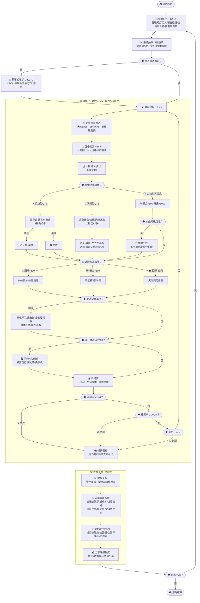

# 股票人生模拟器 — 游戏设计规格说明书

> **项目名称**：股票人生模拟器（Stock Life Simulator）  
> **版本**：V2.0  
> **日期**：2026-04-22  
> **核心哲学**：所有的选择都有价格。  
> **唯一维度**：现金（Cash）与资产（Assets）。

---

## 一、概述

### 1.1 游戏定位
一款以真实A股历史数据为基底的**人生模拟+股票交易策略游戏**。玩家扮演一个刚接触股市的普通人，在10~15个交易日的周期里，通过交易决策、信息套利和生活事件抉择，体验"所有选择都有价格"的核心哲学。

### 1.2 目标平台
- **主平台**：H5 网页游戏（移动端优先，兼容PC浏览器）
- **分发渠道**：微信文章内链接、公众号菜单、群聊/朋友圈分享
- **零资质门槛**：无需游戏版号，个人即可上线

### 1.3 技术栈
- **前端**：Phaser 3 游戏引擎 + TypeScript
- **后端**（Phase 2+）：Node.js 或 Python FastAPI
- **数据**：预处理JSON静态数据包
- **存档**：LocalStorage / IndexedDB（本地），云同步可选

### 1.4 美术风格
**日式卡通 + 经营模拟风**，参考《中国式家长》的温馨调性。角色用Q版卡通形象，事件用卡片式叙事呈现，整体亲切、幽默、有人情味。

### 1.5 核心玩法流程图

> 📎 完整可交互版本：[gameplay-flowchart.html](file:///Users/xiangfang/Developer/projects/Stock_Trading_Life_Simulation/docs/gameplay-flowchart.html)



---

## 二、核心游戏循环

每个交易日约 **10分钟**，分为四个阶段：

### 2.1 盘前阶段（~1分钟）
- 查看系统推送的**免费信息**（大盘趋势、板块热度）
- 查看是否有新的事件卡
- 浏览15支股票昨日收盘情况

### 2.2 盘中交易（~5分钟）
- 15支股票价格按**步进跳动**（每5~10秒刷新一次）
- 玩家可**一键买入/卖出**（极简操盘，重心在决策而非操作）
- 行情界面提供**分时图 + 关键指标（今开/最高/最低）**，可切换**日K线**查看历史走势
- 盘中穿插**QTE事件**（见第五章）
- 可在盘中使用**信息购买**功能（午餐会/研报等）

### 2.3 盘后社交（~3分钟）
玩家选择"晚上去哪"：
| 选项 | 花费 | 效果 |
|------|------|------|
| 🍺 去酒吧 | ¥300 | 获得1条消息（50%真/50%假） |
| 📚 去书店 | ¥100 | 未来5天交易手续费减半（正常手续费=交易金额×1%） |
| 🏠 回家吃饭 | 免费 | 无信息获取，无支出 |

盘后阶段还会触发**生活突发事件**（见第五章）。

### 2.4 日结算（~1分钟）
- 扣除日生活成本
- 更新所有持仓市值
- 显示当日损益报告
- **破产判定**：流动现金 ≤ 0 → 游戏结束

### 2.5 总局结构
- 每局 **10~15个交易日**（约100~150分钟总时长）
- 支持**自动存档**，可跨多次游玩完成一局
- 达标线：总资产 ≥ 起始资金 × 200%

---

## 三、角色系统

游戏开局选择1个角色，影响起始资源、事件密度和特殊能力。

### 3.1 四个可选角色

| 属性 | 🧑‍💻 互联网打工人 | 👔 销售经理 | 🏠 自由职业者 | 👩‍🏫 体制内青年 |
|------|---------------|-----------|-------------|-------------|
| **起始资金** | ¥30,000 | ¥20,000 | ¥50,000 | ¥15,000 |
| **日薪** | ¥800（稳定） | ¥500（稳定） | ¥0~1,000（随机） | ¥400（稳定） |
| **日生活成本** | ¥200 | ¥300 | ¥150 | ¥100 |
| **工作事件频率** | 🔴 高（~2次/天） | 🟡 中（~1次/天） | 🟢 极低（~0.3次/天） | 🟡 低（~0.5次/天） |
| **生活事件频率** | 🟢 低（~0.5次/天） | 🟡 中（~1次/天） | 🔴 高（~1.5次/天） | 🟡 中（~1次/天） |
| **特殊能力** | 每天1条免费行业信息 | 社交花费打8折 | 盘中不被工作事件打断 | 每3天1次免费研报 |
| **隐含难度** | ★★★ 中 | ★★☆ 简单 | ★★★★ 困难 | ★★☆ 简单 |
| **玩法定位** | 信息流选手 | 社交套利型 | 纯操盘手 | 稳健价值投资 |

### 3.2 设计原则
- **没有最优角色**，每个角色是不同的资源约束和策略路线
- 角色本身天然构成不同难度梯度

---

## 四、股票数据系统

### 4.1 股票池
**100支股票**，分为5个热门板块：

| 板块 | 代号前缀 | 数量 | 典型波动特征 |
|------|---------|------|------------|
| 🛒 消费 | 消费-01~20 | 20支 | 稳健偏多，偶有爆发 |
| 💻 科技 | 科技-01~20 | 20支 | 波动大，涨跌幅极端 |
| 🏭 制造 | 制造-01~20 | 20支 | 趋势性强，慢涨慢跌 |
| 💊 医药 | 医药-01~20 | 20支 | 受事件驱动明显 |
| 💰 金融 | 金融-01~20 | 20支 | 波动小，随大盘走 |

### 4.2 每局抽取逻辑
```
每局15支 = 每个板块随机抽3支
         + 其中2~3支被标记为"推荐股"（盘前免费信息中高亮显示）
```
- **推荐股不代表一定涨**，用于测试权威偏见

### 4.3 数据来源与模糊化
```
真实A股历史数据
    ↓ 取10~15个连续交易日
    ↓ 模糊化：价格缩放到¥5~50，抹去日期/公司名/成交量
    ↓ 仅保留：开盘价 → 各步进价格 → 收盘价
    ↓ 挂载"静态信息节点"（基于真实历史事件设置）
    ↓ 分配代号（消费-01）和关键词（果链龙头）
```

### 4.4 行情模式（混合制）
- **新手前几局**：使用精心策划的固定行情组（保证体验质量）
- **之后解锁随机模式**：从A股过去10年数据中随机抽取，近乎无限重玩性

### 4.5 行情显示
- **默认视图**：分时走势图 + 关键指标（今开/最高/最低）
- **可切换**：日K线蜡烛图（查看历史走势）
- 价格每5~10秒步进跳动一次（5分钟盘中约30~60次跳动）

---

## 五、事件系统

### 5.1 三层信息体系

#### 第一层：免费信息（每天盘前自动获取）
- 市场大盘趋势（偏多/偏空）
- 行业板块热度（今日活跃板块）

#### 第二层：付费信息（社交套利）
| 信息类型 | 价格 | 获得内容 | 可靠性 |
|---------|------|---------|--------|
| 🍽️ 午餐会 | ¥500 | 某股未来3天趋势方向 | 80%准确 |
| 📊 买研报 | ¥1,000 | 某股"真实身份关键词" | 100%准确 |
| 🍺 酒吧消息 | ¥300 | 某股具体涨跌幅预测 | 50%准确 |
| 🤝 打点领班 | ¥800 | 未来5天生活费减免30% | 100%生效 |

#### 第三层：情报串联（自动触发）
当对同一支股票累计获得 **2条以上不同来源的信息** 时，系统自动触发情报串联，给出高确信度（~90%准确）的综合研判。

### 5.2 社交套利类事件（主动触发）
盘中可主动发起信息购买（占用部分交易时间），盘后通过场景选择获取信息。

### 5.3 工作场所类事件（盘中被动弹出）

**反应型QTE（3秒限时点击）**：
| 事件 | 成功 | 失败 |
|------|------|------|
| ⚡ 领导巡视 | 及时切屏，无损失 | 被发现炒股，罚款¥2,000 |
| ⚡ 客户电话 | 接听，获得¥500奖金 | 漏接，扣绩效¥1,000 |

**决策型QTE（10秒限时选择）**：
| 事件 | 选项A | 选项B |
|------|-------|-------|
| 🤔 紧急开会 | 参会：失去下午交易权，得¥1,000奖金 | 摸鱼：保留交易权，50%被抓罚¥3,000 |
| 🤔 项目加班 | 加班：无盘后社交，明天双倍日薪 | 拒绝：正常流程，20%影响下次奖金 |
| 🤔 同事求助 | 帮忙：损失10秒交易时间，获一条免费情报 | 拒绝：无损失无收益 |

### 5.4 生活突发类事件（盘后/日结算被动弹出）
| 事件 | 效果 |
|------|------|
| 🏠 家电坏了 | 强制支出¥2,000 |
| 👨‍👩‍👦 亲友借钱 | A: 借出当前流动现金的20%，10天后返还120% / B: 拒绝，失去一个内部消息源 |
| 💍 老婆指教 | 当日大亏时触发，强制购买道歉礼物（金额=当日亏损×20%） |
| 🏥 身体不适 | 明天盘中交易时间缩短为3分钟 |
| 🎉 朋友请客 | 免费获得一条模糊信息 |

### 5.5 消费冲动类事件（盈利后触发）
| 事件 | 触发条件 | 选项 |
|------|---------|------|
| 🛍️ 犒劳自己 | 当日盈利 > ¥2,000 | A: 花¥1,500吃大餐（明天QTE成功率+10%） / B: 忍住 |
| 🎁 给家人买礼物 | 当日盈利 > ¥3,000 | 强制支出¥1,000，减少未来"老婆指教"概率 |
| 📱 换新手机 | 当日盈利 > ¥5,000 | A: 花¥4,000（纯消费） / B: 把钱加仓（贪心陷阱） |

### 5.6 事件密度
由角色决定，可配置：
| 角色 | 工作事件/天 | 生活事件/天 | 总事件/天 |
|------|-----------|-----------|----------|
| 互联网打工人 | ~2 | ~0.5 | ~2.5 |
| 销售经理 | ~1 | ~1 | ~2 |
| 自由职业者 | ~0.3 | ~1.5 | ~1.8 |
| 体制内青年 | ~0.5 | ~1 | ~1.5 |

---

## 六、经济模型

### 6.1 核心公式
```
当日总结余 = 上日现金 + 日薪收入 + 股票卖出所得
           - 买入支出 - 生活成本 - 社交/信息支出
           - 事件损失 ± QTE结果
```

### 6.2 资金分类
- **流动现金**：用于买股、付费、支付生活费
- **持仓市值**：已购入股票，随行情实时波动
- **总资产** = 流动现金 + 持仓市值

### 6.3 交易手续费
- 每笔买入/卖出收取交易金额的 **1%** 作为手续费
- 去书店可将手续费减半至0.5%（持续5天）

### 6.4 关键规则
- 流动现金 ≤ 0 即**破产**（持仓不可立即变现——模拟流动性风险）
- 总资产 ≥ 起始资金 × 200% 触发**胜利结局**

---

## 七、终局复盘系统

### 7.1 触发条件
- 💀 破产 / 🏆 达标 / 📅 到期（三选一）

### 7.2 复盘流程（约2分钟）

**Step 1 — 揭开面纱**：逐个揭示15支股票的真实身份 + 后续走势彩蛋

**Step 2 — 数据复盘**：资产变化曲线 + 操盘收益 vs 事件决策收益对比

**Step 3 — 认知偏差诊断**：
| 认知偏差 | 检测逻辑 | 正向引导 |
|---------|---------|---------|
| 追涨杀跌 | 连涨后买入，连跌后卖出 | 提示追高风险 |
| 沉没成本 | 深度亏损持续持有不止损 | 鼓励理性割舍 |
| 过度交易 | 日均交易次数远超平均 | 提示频繁交易≠策略 |
| 信息过载 | 大量购买信息但未据此交易 | 提示信息≠行动力 |
| 损失厌恶 | 盈利快跑、亏损死扛 | 提示"割肉太慢、跑太快" |
| 消费冲动 | 盈利后大量消费 | 提示利润回吐心理 |

**Step 4 — 多维评分 + 称号**：
- 四维雷达图：投资智慧 / 社交回报 / 生活平衡 / 心态稳定
- 授予个性化称号 + 一句正向总结语

**Step 5 — 分享海报**：
- 自动生成卡片：称号 + 收益率 + 一句话 + 二维码
- 可截图或直接分享到微信

### 7.3 全服排行榜
| 排行类型 | 排行维度 | 刷新周期 |
|---------|---------|---------|
| 💰 总收益榜 | 总资产收益率 | 实时 |
| 🧠 智慧榜 | 投资智慧评分 | 每日 |
| 🤝 社交达人榜 | 社交投资回报率 | 每日 |
| 🏅 全能榜 | 四维总分 | 每周 |

### 7.4 设计理念
> **不嘲笑玩家，而是让玩家"旁观自己"。**  
> 每一局游戏就像一面镜子——你以为你在模拟炒股，其实你在暴露自己的决策本能。  
> 在安全的环境里犯错，在犯错中认识自己。

---

## 八、新手引导

### 8.1 叙事式教学
以"一个刚接触炒股的新人"为叙事切入，前1~2个交易日设计为教学关卡：
- 第1天：NPC（同事/朋友）引导认识交易界面、学会买卖
- 第2天：遭遇第一个工作事件 + 获得第一条信息，学会信息套利和QTE
- 第3天起：正式进入自由模式

### 8.2 设计原则
- 教学过程是角色成长故事的一部分，不跳出叙事
- 不强制全部教学，核心操作教完即放手

---

## 九、开发分阶段计划

### Phase 1 — 核心体验验证（4~6周）
- 1个角色（互联网打工人）
- 15支股票（1组策划好的固定行情）
- 极简交易 + 分时图/日K切换
- 基础事件（每类3~4个）
- 简化版日结算
- 无排行榜、无教学、无分享海报
- **目标**：找10人试玩验证核心循环

### Phase 2 — 内容丰富 + 社交（4~6周）
- 4角色全部上线
- 100股池 + 混合行情模式（策划+随机）
- 三层信息系统完整实现
- 混合QTE全部类型
- 终局复盘（认知偏差诊断 + 称号 + 评分）
- 分享海报 + 全服排行榜
- 后端API搭建

### Phase 3 — 叙事与打磨（3~4周）
- 叙事式教学关卡
- 丰富事件库（每类10+事件）
- 情报串联系统
- UI打磨 + 音效 + 微动画
- 成就系统
- 性能优化

---

## 十、技术架构

```
┌────────────────────────────────────────┐
│              前端 (H5)                  │
│  Phaser 3 (游戏引擎) + TypeScript       │
│  · 场景管理（盘前/盘中/盘后/复盘）         │
│  · UI组件（交易面板/事件卡/K线图）         │
│  · 动画系统（QTE/事件/结算）              │
│  · 本地存档 (LocalStorage/IndexedDB)     │
├────────────────────────────────────────┤
│              后端 (Phase 2+)             │
│  Node.js / Python FastAPI               │
│  · 排行榜 API                           │
│  · 分享海报生成                          │
│  · 用户存档云同步（可选）                  │
├────────────────────────────────────────┤
│              数据层                      │
│  · 100支股票历史行情（预处理JSON）         │
│  · 事件库（JSON配置文件）                 │
│  · 信息节点映射表                        │
│  · 排行榜数据 (Redis / SQLite)           │
└────────────────────────────────────────┘
```

Phase 1：纯前端 + 静态JSON数据，无后端依赖。
