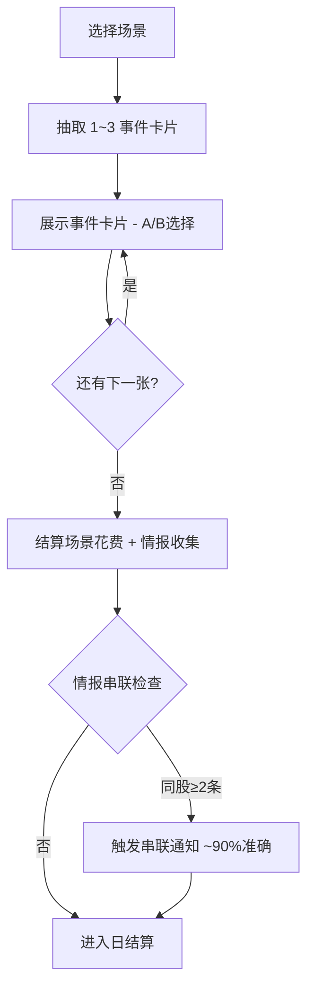

# 补齐 3 个核心玩法缺口 — 设计方案

> **目标**：严格按照 [Requirements.md](file:///Users/xiangfang/Developer/projects/Stock_Trading_Life_Simulation/docs/Requirements.md) 规范，补齐场景事件卡片、情报串联增强、生活事件频率三个核心缺口

---

## 一、架构改动总览



### 核心改动
1. **新增** `SCENE_EVENTS` 数据模块 — 10个场景 × 3~5个事件 = ~40个事件
2. **新增** `SCENE_CARDS` phase — 介于选场景和日结算之间
3. **修改** `confirmScene()` — 从「选场景→直接结算」改为「选场景→翻事件卡片→逐张决策→结算」
4. **增强** 情报串联 — 加入准确度机制和情报串联 toast 通知
5. **调整** 生活事件概率常量

---

## 二、场景事件卡片系统

### 2.1 数据结构

```js
// 新文件: frontend/src/data/sceneEvents.js
const SCENE_EVENTS = {
    "🏠 回家吃泡面": [
        {
            id: "home_01",
            title: "📺 深夜财经节目",
            desc: "电视正好播到一档股评节目，主持人信誓旦旦地推荐了一只股票...",
            options: [
                { text: "认真看完并记下来", effect: "info", quality: 0.3 },
                { text: "切到综艺频道（无事发生）", effect: "none" }
            ]
        },
        // ... 3~5个事件
    ],
    "🍺 酒吧": [
        {
            id: "bar_01", 
            title: "🍺 有人请你喝酒",
            desc: "隔壁桌一个看起来很面善的大哥主动给你倒了杯威士忌...",
            options: [
                { text: "喝！花 ¥200 聊聊（获一条消息）", effect: "info", cost: 200, quality: 0.5 },
                { text: "谢绝好意（无成本）", effect: "none" }
            ]
        },
        // ...
    ]
};
```

### 2.2 事件池设计（全部 10 个场景）

#### 🏠 回家吃泡面（0元 · 3个事件）
| 事件 | 选项A | 选项B |
|------|-------|-------|
| 📺 深夜财经节目 | 看完并记下（30%准确消息） | 切综艺（无事发生） |
| 📦 翻出旧报纸 | 研读财经版（获一条模糊旧闻） | 直接扔掉 |
| 🛏️ 失眠反思 | 复盘今天操作（无消费，心态提示） | 直接睡觉 |

#### 🌳 公园散步（0元 · 4个事件）
| 事件 | 选项A | 选项B |
|------|-------|-------|
| 👴 偶遇退休老股民 | 聊聊（30%准确消息） | 点头微笑离开 |
| 🐕 遛狗大妈搭话 | 听她聊邻居炒股故事（30%消息） | 借口赶时间 |
| 📻 广场舞队放财经播报 | 驻足听一会（20%模糊消息） | 继续走 |
| 🧘 公园冥想 | 静坐10分钟（无消费，心态提示） | 跳过 |

#### 📱 刷手机（0元 · 4个事件）
| 事件 | 选项A | 选项B |
|------|-------|-------|
| 📰 大V推荐文章 | 仔细阅读（40%准确消息） | 划走不看 |
| 💬 股吧热帖 | 追帖讨论（40%准确消息） | 关闭APP |
| 📊 券商弹窗研报 | 点进去看（50%准确消息） | 关掉弹窗 |
| 🎮 游戏好友拉你打排位 | 打一局放松心情 | 拒绝（继续刷财经） |

#### 🍜 大排档（¥200 · 4个事件）
| 事件 | 选项A | 选项B |
|------|-------|-------|
| 🍺 老股民吹牛 | 再买一轮酒 ¥100（60%准确） | 听他免费吹（30%准确） |
| 👨‍🍳 老板娘聊闲天 | 聊聊（她老公是操盘手·50%消息） | 只管吃饭 |
| 📞 朋友打来电话发股票截图 | 相信他（50%消息） | 当耳旁风 |
| 🤝 隔壁桌是同行 | 加微信换消息（60%准确） | 各吃各的 |

#### 📚 书店（¥100 · 3个事件）
| 事件 | 选项A | 选项B |
|------|-------|-------|
| 📖 买到一本交易心理学 | 认真阅读（手续费减半5天） | 翻了翻放回去 |
| 🧑‍🏫 偶遇大学金融教授 | 请教投资策略（获一条行业趋势） | 装作不认识 |
| 📰 发现限量财经月刊 | 花 ¥50 买下（50%准确消息） | 太贵了不买 |

#### 🏪 便利店买啤酒（¥50 · 3个事件）
| 事件 | 选项A | 选项B |
|------|-------|-------|
| 🍻 收银员小哥搭话 | 聊两句（他学金融的·30%消息） | 付钱走人 |
| 📰 看到收银台的财经杂志 | 站着翻两页（20%模糊消息） | 不感兴趣 |
| 🎰 门口刮刮乐 | 花 ¥20 试试手气（随机±¥50~200） | 不赌 |

#### 🍺 酒吧（¥300 · 5个事件）
| 事件 | 选项A | 选项B |
|------|-------|-------|
| 🍸 有人请你喝酒 | 喝！¥200（随机质量消息） | 谢绝 |
| 📞 老板打电话 | 接听：明天加班双倍日薪 | 挂断（正常，20%影响奖金） |
| 🤝 遇到前同事 | 聊聊（获一条行业内部消息·70%） | 装没看见 |
| 💃 搭讪券商销售 | 加微信（50%准确消息） | 社恐不敢 |
| 🎲 有人邀你玩骰子 | 参加 ¥300（赢概率45%·赢¥600） | 不赌 |

#### 🍽️ 高级餐厅（¥800 · 4个事件）
| 事件 | 选项A | 选项B |
|------|-------|-------|
| 🍷 偶遇基金经理 | 请他喝红酒 ¥200（80%准确3日趋势） | 点头之交 |
| 💼 邻座是上市公司高管 | 主动搭讪（70%准确消息） | 安静用餐 |
| 📋 餐厅老板推荐私募 | 听他说（60%消息） | 礼貌拒绝 |
| 🎻 听到VIP包间传出消息 | 竖起耳朵偷听（50%消息） | 装作没听到 |

#### 🎤 KTV包场（¥1500 · 3个事件）
| 事件 | 选项A | 选项B |
|------|-------|-------|
| 🎤 唱到嗨点忘记忧愁 | 尽情唱（降低明天负面事件概率） | 低调旁观 |
| 🍾 有人开香槟庆祝 | 凑过去聊（40%消息） | 继续唱歌 |
| 💰 朋友提议AA赌下一首谁唱得好 | 参加 ¥200（赢概率50%·赢¥400） | 算了 |

#### 💆 SPA会所（¥2000 · 4个事件）
| 事件 | 选项A | 选项B |
|------|-------|-------|
| 💎 VIP休息区遇神秘大佬 | 攀谈（100%准确·股票真实身份） | 安静休息 |
| 🧖 技师聊天 | 听她说老顾客都投什么（50%消息） | 安静享受 |
| 📱 收到私募基金邀请短信 | 留个联系方式（80%准确消息） | 删除 |
| 🔮 遇到一位「命理大师」 | 花 ¥500 测测财运（90%准确） | 不信这个 |

---

## 三、情报串联增强

### 3.1 当前状态
前端已有串联显示代码（App.jsx:836-856），但几乎不会触发，因为每场景只给一条固定情报。

### 3.2 改动
- **多事件卡片**会让同一股票可以从不同场景/不同事件获得多条情报 → 自然触发串联
- **增加准确度机制**：串联情报应参考 `marketData.intelligence` 的 `direction`，给出更具体的研判
- **增加 Toast 通知**：当新情报触发串联时（≥2条不同来源），弹出 GameToast 提示

### 3.3 串联逻辑增强
```js
// 每次 addInfoHint 后检查
const checkIntelLinking = (stock) => {
    const infos = store.gatheredInfo.filter(i => i.stock === stock);
    const sources = new Set(infos.map(i => i.source));
    if (sources.size >= 2) {
        // 根据 intelligence 数据生成 ~90% 准确的综合研判
        toast.show(`💡 情报串联触发！${stock} 已有 ${sources.size} 条不同来源消息，交叉验证置信度极高！`, "success", 5000);
    }
};
```

---

## 四、生活事件频率调整

### 4.1 当前值 vs 规范值

| 角色 | 当前 | 规范要求 | 调整为 |
|------|------|---------|--------|
| 互联网打工人 | 15% | ~50%/天 | **50%** |
| 销售经理 | 25% | ~100%/天 | **65%** |
| 自由职业者 | 40% | ~150%/天 | **80%** |
| 体制内青年 | 10% | ~100%/天 | **55%** |

> [!NOTE]
> 规范中"~1.5次/天"意味着某些天可以触发多个事件。但当前架构每天只触发一个事件。折中方案：把概率调到接近规范水平，但仍保持单事件/天模型，避免过于频繁打断节奏。

### 4.2 改动位置
[App.jsx:381-386](file:///Users/xiangfang/Developer/projects/Stock_Trading_Life_Simulation/frontend/src/App.jsx#L381-L386) — 只改4个数字。

---

## 五、新增 Phase 流程

```
当前: NIGHT(选场景) → DECISION(确认场景) → confirmScene() → 日结算

改后: NIGHT(选场景) → SCENE_CARDS(翻事件卡片×1~3张) → 日结算
```

- `DECISION` phase 保留但改造为场景内事件卡片展示
- 每张卡片展示后等待用户选择 A/B
- 所有卡片处理完后，自动进入日结算

---

## 六、文件改动清单

| 文件 | 改动类型 | 说明 |
|------|---------|------|
| `frontend/src/data/sceneEvents.js` | **[NEW]** | 10个场景的事件池定义（~40个事件） |
| `frontend/src/App.jsx` | **[MODIFY]** | phase流程改造 + 事件频率调整 + 情报串联增强 |
| `frontend/src/components/DecisionCard.jsx` | **[MODIFY]** | 改造为支持多事件卡片翻牌UI |

---

## 七、UI 设计

### 事件卡片翻牌界面
- 顶部：场景名称 + 「卡片 1/3」进度指示
- 中间：事件标题 + 描述文字（speech-bubble 风格）
- 底部：两个按钮（选项A / 选项B）
- 选择后：显示结果文字 + 自动翻到下一张（0.8s延迟）
- 全部完成后：显示汇总 → 按钮「进入日结算」

### 情报串联触发动效
- GameToast 弹出「💡 情报串联！」
- 情报笔记本中该股的串联条目高亮闪烁
